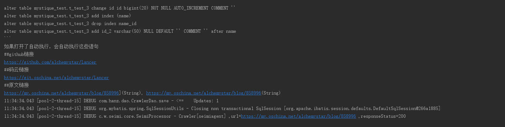
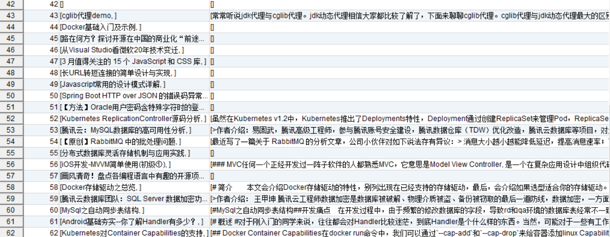

# SeimiCrawler
<<<<<<< HEAD

本项目是基于开源框架`SeimiCrawler`实现的静态页面及动态渲染页面爬取的DEMO。关于该框架的完整内容请参考：

https://github.com/zhegexiaohuozi/SeimiCrawler

以下是简单的测试结果：

=======
本项目是基于开源框架`SeimiCreler`实现的静态页面及动态渲染页面爬取的DEMO。关于该框架的完整内容请参考：
https://github.com/zhegexiaohuozi/SeimiCrawler

## 运行结果

## 数据库持久化

>>>>>>> update
